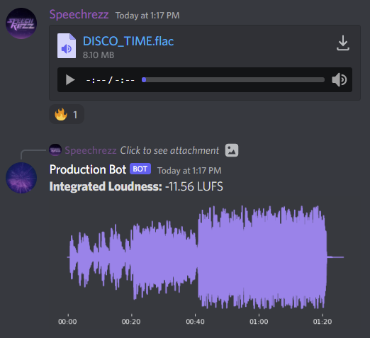

# Music Production Bot
This is a Discord bot specifically designed for music production servers.

- Add bot to your server: [Click here](https://discord.com/api/oauth2/authorize?client_id=959708215627612162&permissions=274877918272&scope=bot)
- Join my Discord server to try it out: [Click here](https://discord.gg/M9Ze7cCZrv)

## Features:
- Displays waveform of sound files.
- Calculates loudness (in LUFS) of sound files.
- Server dependent settings (type `!help` for commands).
- Keeps track of loudest audio files sent via a leaderboard (type `!leaderboard`)

## How to use:
- By default, the bot will analyze sound files sent in any text channel. 
- To limit the bot to work in only specific text channels, use the `!add_channel [channel name]`

## To-do:
- Audio processing commands, such as `!nightcore`
- Enforce users to give feedback to other's tracks before posting their own.
- Make it look nicer.

## How to contribute:
1. Clone the repository
2. Create a file named `token.txt` in the same directory as the python file.
3. Paste the Discord bot token in the file.
4. `pip3 install` all depdencies (`discord`, `pymongo`, `matplotlib`, `numpy`, `pyloudnorm`, `pydub`).
5. Setup a local (or cloud-based) MongoDB database.
6. Run `music_bot.py`

## License:
GNU GENERAL PUBLIC LICENSE (GLP) 3.0